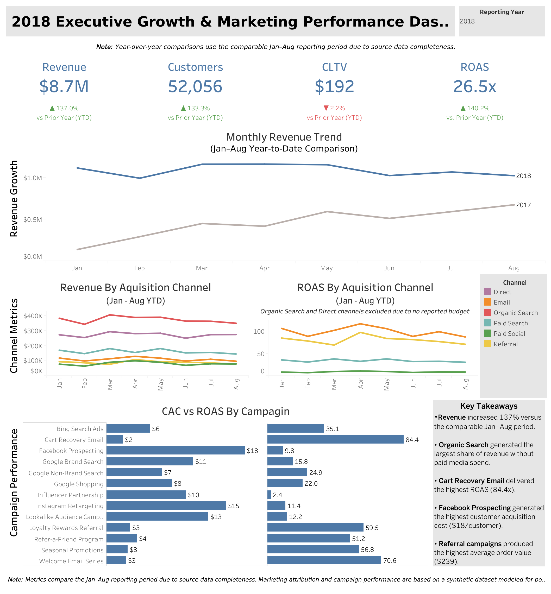

# End-to-End E-Commerce Analytics Platform
### Azure Databricks • Delta Lake • Medallion Architecture • PySpark • Tableau

An end-to-end Analytics Engineering project that transforms raw e-commerce transaction data into executive-ready business insights using Azure Databricks, Delta Lake, Medallion Architecture, and Tableau. The project demonstrates not only modern data engineering and semantic modeling practices, but also responsible cloud resource management through Azure budget monitoring and cost governance.

The project extends the original Olist Brazilian E-Commerce dataset with synthetic marketing attribution data to simulate a realistic digital marketing environment. The final deliverable is an Executive Growth & Marketing Performance Dashboard designed for business stakeholders.

---
## Executive Dashboard



# Highlights

- Executive KPI scorecards
- YoY revenue, customer, CLTV, and ROAS analysis
- Acquisition channel performance
- Campaign performance (CAC vs. ROAS)
- Executive insights panel

---
## Solution Architecture


---
## Databricks Pipeline


Azure Databricks notebook demonstrating the Gold layer transformation pipeline, where validated Silver tables are aggregated into analytics-ready business models using PySpark and Delta Lake.

---

# Project Overview

Modern organizations require more than dashboards—they need reliable, analytics-ready data products built on scalable data architecture.

This project demonstrates the complete analytics engineering workflow:

- Ingest raw transactional data into a Delta Lakehouse
- Build Bronze, Silver, and Gold data layers using Medallion Architecture
- Apply data quality validation throughout the pipeline
- Create analytics-ready semantic models
- Generate synthetic customer acquisition and campaign attribution data
- Design executive KPIs
- Deliver an interactive Tableau dashboard for business decision-makers

---

# Business Problem

The original Olist dataset contains detailed e-commerce transactions but lacks marketing attribution and customer acquisition data needed to answer common executive questions such as:

- Which acquisition channels generate the most revenue?
- Which marketing campaigns produce the highest ROAS?
- Which channels acquire the highest-value customers?
- How efficiently is marketing spend converted into revenue?
- How is the business performing compared to the previous year?

To address these limitations, synthetic marketing data was generated and integrated into the warehouse while preserving realistic business relationships.

---

# Technology Stack

## Languages

- Python
- PySpark
- SQL

## Data Engineering

- Azure Databricks
- Delta Lake
- Unity Catalog
- Delta Tables

## Cloud

- Azure
- Unity Catalog Volumes

## Cloud Cost Management

To simulate a production-minded cloud environment while controlling costs, Azure budget monitoring and governance features were configured throughout the project.

### Cost Controls

- Created Azure Budget alerts with a target monthly budget of **$20 USD**
- Configured automated email notifications at budget thresholds
- Used compute auto-termination to prevent idle Databricks clusters
- Selected appropriately sized compute resources for development workloads
- Regularly monitored Azure Cost Management to track resource consumption

These controls allowed the project to remain within the planned monthly budget while demonstrating practical cloud cost management and governance practices.

## Analytics

- Tableau Desktop
- Tableau Extracts

## Concepts Demonstrated

- Medallion Architecture
- ELT Pipeline Design
- Data Validation
- Semantic Modeling
- Antalytics Engineering
- Marketing Attribution
- Executive Dashboard Design

---

# Architecture

```text
                 Raw CSV Files
                       │
                       ▼
              Bronze Delta Tables
          (Raw ingestion + metadata)
                       │
                       ▼
            Silver Business Entities
      (Cleaned, validated, standardized)
                       │
                       ▼
          Gold Semantic Business Models
      (Business metrics & dimensional data)
                       │
                       ▼
      Executive Tableau Dashboard
```

---

# Bronze Layer

The Bronze layer ingests raw source files into Delta Lake while preserving the original data.

### Responsibilities

- Raw ingestion
- Schema preservation
- Metadata tracking
- Delta table creation

### Metadata

- `_ingested_at`
- `_source_file`

### Tables

- bronze_customers
- bronze_orders
- bronze_order_items
- bronze_products
- bronze_order_payments

---

# Silver Layer

The Silver layer cleans and standardizes business entities while validating data quality.

### Responsibilities

- Remove duplicates
- Validate business rules
- Standardize dates
- Verify foreign keys
- Prepare analytics-ready entities

### Tables

- silver_customers
- silver_orders
- silver_order_items
- silver_products
- silver_order_payments
- silver_customer_acquisition
- silver_marketing_campaigns

### Validation Examples

- Duplicate detection
- Missing key validation
- Invalid delivery dates
- Invalid approval timestamps
- Row count verification

---

# Gold Layer

The Gold layer contains semantic business models optimized for reporting and analytics.

## gold_order_facts

Business grain:

> One row per order

Used for:

- Revenue
- Orders
- AOV
- Delivery metrics
- Executive revenue reporting

---

## gold_customer_marketing_metrics

Business grain:

> One row per customer

Used for:

- Customer Lifetime Value
- Repeat Customer Rate
- Customer segmentation
- Acquisition channel analysis

---

## gold_campaign_performance

Business grain:

> One row per campaign

Used for:

- Campaign ROAS
- Customer Acquisition Cost
- Campaign performance ranking
- Customer quality metrics

---

## gold_campaign_monthly_performance

Business grain:

> One row per campaign per month

Used for:

- Monthly revenue trends
- Monthly ROAS
- Marketing spend analysis
- Year-over-Year reporting
- Executive dashboard time series

---

# Synthetic Marketing Attribution

Because the Olist dataset contains no marketing data, realistic acquisition information was generated.

The synthetic model includes:

## Acquisition Channels

- Organic Search
- Direct
- Paid Search
- Paid Social
- Email
- Referral

## Campaign Attributes

- Campaign budgets
- Quality scores
- Customer lifetime multipliers
- Repeat customer probabilities
- Target audiences
- Attribution windows

This allows the warehouse to answer marketing questions typically unavailable in public datasets.

---

# Executive Dashboard

The final Tableau dashboard follows an executive reporting workflow.

## Executive KPIs

- Revenue
- Customers
- Average Customer Lifetime Value
- Return on Ad Spend (ROAS)

Each KPI includes:

- Comparable Year-to-Date calculation
- Year-over-Year comparison
- Directional performance indicator

---

## Business Health

- Monthly Revenue Trend
- Revenue by Acquisition Channel
- ROAS by Acquisition Channel

---

## Campaign Performance

- Customer Acquisition Cost by Campaign
- Return on Ad Spend by Campaign

---

## Executive Insights

The dashboard concludes with automated business takeaways summarizing key findings for executive stakeholders.

---

# Repository Structure

```text
ecommerce-medallion-architecture/

├── notebooks/
│   ├── 01_ingestion_bronze.py
│   ├── 02_bronze_to_silver.py
│   ├── 03_growth_analytics_models.py
│   └── 04_silver_to_gold.py
│
├── dashboards/
│
├── images/
│
├── diagrams/
│
└── README.md
```

---

# Key Analytics Engineering Concepts

- Azure Databricks
- Delta Lake
- Medallion Architecture
- PySpark Transformations
- Data Validation
- Semantic Modeling
- Dimensional Design
- Executive KPI Development
- Marketing Attribution
- Customer Lifetime Analytics
- Tableau Dashboard Development
- Cloud Cost Management
- Azure Budget Monitoring

---

# Future Enhancements

- Incremental Delta processing
- Slowly Changing Dimensions (SCD Type 2)
- dbt implementation
- Automated data quality testing
- CI/CD deployment
- Workflow orchestration
- Real-time streaming ingestion

---

# Author

**Nikao Wallace**

Aspiring Analytics Engineer focused on building scalable cloud data solutions that transform raw data into business-ready insights.